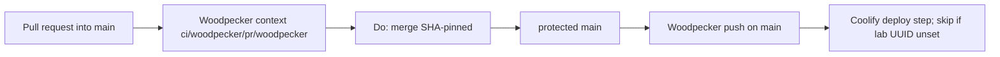

# Architecture overview

`code/hello` is the public identity-smoke repository for org **code**. Day-to-day git identity is **PlasticDigits**, not the Forgejo instance admin. It is not a product runtime: scanners and a lab Coolify hook exist so trusted-PR and protected-`main` behavior can be proven on a small tree.

Standing merge and CI rules live here. The catch-all `CODEOWNERS` removal is decided in [ADR 0001](adr/0001-remove-catchall-codeowners.md) ([#15](https://git.cl8y.com/code/hello/pulls/15)); do not duplicate that narrative. These files reach `main` on the product PR (ADR 0001 vehicle **B**), not by merging design branch `cac-design-issue-15`.

## Merge gate (H15)

Three contract groups. Operator `GET /api/v1/repos/code/hello/branch_protections` must equal the **protection** rows only (dated GET 2026-09-21, after [cl8y-forgejo#48](https://git.cl8y.com/PlasticDigits/cl8y-forgejo/issues/48) rollout). That list endpoint returns an **array**; pick `rule_name == "main"` (or `GET /api/v1/repos/code/hello/branch_protections/main`). A green Woodpecker run is **not** proof of **H15-2**, **H15-8**, **H15-3**, **H15-9**, **H15-10**, or **H15-5**.

### Protection GET (six flags)

| ID | Flag | Required value |
| --- | --- | --- |
| **H15-2** | `enable_push` | `false` (no direct `main`, no force-push) |
| **H15-8** | `enable_status_check` | `true` |
| **H15-3** | `status_check_contexts` | `["ci/woodpecker/pr/woodpecker"]` (array **equal**, not subset) |
| **H15-9** | `required_approvals` | `0` |
| **H15-10** | `block_on_official_review_requests` | `false` |
| **H15-5** | `block_on_rejected_reviews` | `true` |

GET equality is these six rows for the `main` rule. Merge procedure is not a protection field. **H15-8** stays in this table.

A leftover official CODEOWNERS request on [#15](https://git.cl8y.com/code/hello/pulls/15) does not block merge because of **H15-10** and **H15-9** only. `enable_status_check` does not decide whether an official CODEOWNERS request blocks merge.

### Merge procedure

| ID | Rule |
| --- | --- |
| **H15-4** | SHA-pinned `Do: merge` with `head_commit_id`. Never document or use `force_merge`. |

### Tree contracts

| ID | Rule |
| --- | --- |
| **H15-1** | `test -f` fails on `CODEOWNERS`, `docs/CODEOWNERS`, `.gitea/CODEOWNERS`, and `.forgejo/CODEOWNERS`. |
| **H15-6** | Coolify secrets never attach to `pull_request` events. Deploy step stays `main` push only. |
| **H15-7** | This tree does not expand CAC merge/deploy/spend/custody policy. |

Official CODEOWNERS review is **not** a merge gate. Forgejo loads the first existing file among `CODEOWNERS`, `docs/CODEOWNERS`, `.gitea/CODEOWNERS`, and `.forgejo/CODEOWNERS` (Go-regexp, not GitHub globs; `.forgejo/` added in forgejo#8773; `.gitea/` remains in the walk). **H15-1** holds after land of the product PR, not after this ADR exists on the design branch. None of those paths may contain a reviewer rule for any pattern (ADR 0001 Decision 2). Do not leave an empty or comments-only file; Forgejo still parses it.

## Pipeline

[`.woodpecker.yaml`](../.woodpecker.yaml) is digest-pinned. PR and `main` push run Gitleaks, OpenGrep, and Trivy fs. Coolify deploy runs only on **successful `main` push**, with secrets allowed on `push`/`manual` only — never `pull_request`. Community forks are not Woodpecker projects.

This tree does not change Forgejo protection JSON, CAC autoland predicates, or Coolify app config. Those remain [cl8y-forgejo#48](https://git.cl8y.com/PlasticDigits/cl8y-forgejo/issues/48), [cl8y-agent-control#429](https://git.cl8y.com/PlasticDigits/cl8y-agent-control/issues/429), and [agent-control #297](https://git.cl8y.com/PlasticDigits/cl8y-agent-control/issues/297) respectively.
